这篇文章[《制作简单FPS游戏》](https://www.cnblogs.com/leoin2012/p/11713524.html)介绍了如何在UE下用蓝图制作一个简单的FPS游戏，本文按其步骤，用TypeScript实现了一遍，熟悉蓝图的同学可以通过两边对照，找到蓝图怎么换成TypeScript的感觉；不熟悉蓝图的同学也可以直接看本文。

### 起步入门

下载[示例项目](https://koenig-media.raywenderlich.com/uploads/2018/01/BlockBreakerStarter.zip)并解压。进入项目文件夹（BlockBreakerStarter），双击**BlockBreaker.uproject**打开项目，我们能看到以下场景：

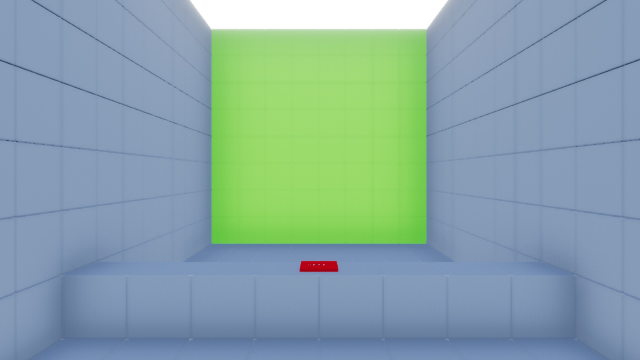

绿色墙上包含着多个目标，当目标受到伤害时会变红。一旦血量值降为零，目标就会消失。红色按钮可以重置所有的目标。

### TypeScript编程环境搭建

目前步骤略显复杂，所幸一个项目只需做一次，而且后续会通过在UE商城上架组件来简化。

* 下载（或clone）puerts的unreal demo（假设放puerts\_unreal\_demo目录），右键选择puerts\_unreal\_demo.uproject生成vs工程，然后打开vs工程编译；
* 拷贝puerts\_unreal\_demo\\Plugins到BlockBreakerStarter，拷贝puerts\_unreal\_demo\\Plugins\\Puerts\\Content下的内容到BlockBreakerStarter\\Content
* 命令行进入BlockBreakerStarter\\Content\\JavaScript\\PuertsEditor，执行命令\`npm install .\`
* 双击**BlockBreaker.uproject**打开项目，菜单上选择“编辑->项目设置”，打开设置页面后在“插件->Puerts Setting”中把“Puerts Module Enable”勾选上

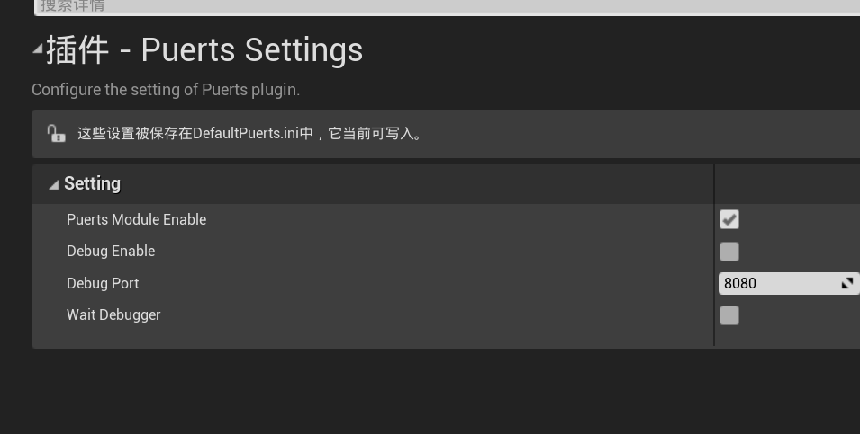

* 点击puerts的生成按钮，这步骤会生成UE API的TypeScript声明

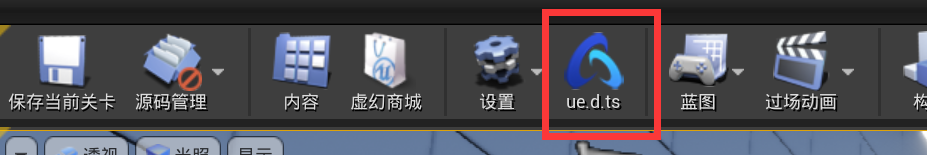

* BlockBreakerStarter下新建TypeScript目录

* BlockBreakerStarter下新建tsconfig.json，在tsconfig.json输入如下内容。

```json
{
  "compilerOptions": {
    "target": "esnext",
    "module": "commonjs",
    "jsx": "react",
    "sourceMap": true,
    "typeRoots": [
      "Plugins/Puerts/Typing",
      "./node_modules/@types"
    ],
    "outDir": "Content/JavaScript"
  },
  "include": [
    "TypeScript/**/*"
  ],
}
```

### 创建玩家角色

vscode打开BlockBreakerStarter目录，在TypeScript目录新建TS\_Player.ts文件，输入如下代码：

```typescript
import * as UE from 'ue'

class TS_Player extends UE.Character {
}

export default TS_Player;
```

这样就新建了个能在UE编辑器下使用的TypeScript类。  
注意：要满足**以下三点**，一个类才能被UE编辑器使用：

1.  这个类继承自UE的类或者另一继承UE的类；
2.  类名和去掉.ts后缀的文件名相同；
3.  把这个类export default。

**Character**本身是Pawn的一种，额外多了一些其他功能，比如**CharacterMovement**组件。

该组件会自动处理如走动跑跳等移动功能，我们只要简单调用对应函数就可以移动角色。我们也可以在该组件设置走路速度，起跳速度等变量。

在实现移动功能前，Character需要知道玩家的按键情况，所以我们先将移动映射到**W**，**A**，**S**和**D**键上。

#### 创建移动映射

选择**Edit\\Project Settings**，打开**Input**设置。

创建两个名为**MoveForward**和**MoveRight**的**轴映射**。MoveForward控制前后移动，MoveRight控制左右移动。

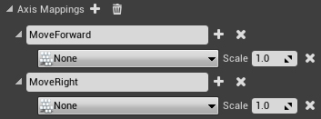]

对于**MoveForward**，将按键改为**W**，随后，创建多一个键位插槽，将其设置为**S**，并将**Scale**改为**\-1.0**。

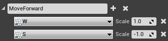

随后，我们会将Scale值跟角色朝向向量相乘，当Scale值是**正数**时，向量方向**朝前**，当Scale值是**负数**时，向量方向**朝后**。通过得出的向量结果，我们就可以让角色朝前朝后移动了。

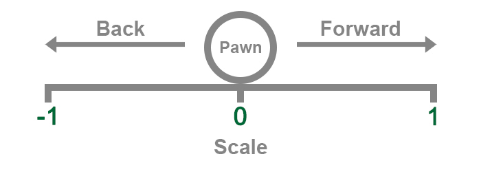

接着，我们要对左右移动做同样的设置，将**MoveRight**设为**D**，新建键位插槽设为**A**，**Scale**值设为**\-1.0**。


现在我们设置好了键位映射，就可以用它们来进行移动了。

#### 实现移动

在**TS\_Player**输入**MoveForward**和**MoveRight**的处理代码：

```typescript
class TS_Player extends UE.Character {
    MoveForward(axisValue: number): void {
        this.AddMovementInput(this.GetActorForwardVector(), axisValue, false);
    }

    MoveRight(axisValue: number): void {
        this.AddMovementInput(this.GetActorRightVector(), axisValue, false);
    }
}
```

代码解释：

1.  **MoveForward**回调的**axisValue**参数，当按下**W**时为**1**，当按下**S**时为**\-1**，什么都不按，是**0**
2.  **AddMovementInput**函数将玩家**朝向向量**与**ScaleValue**相乘，使得不同按键控制输出不同方向的向量。什么都不按，意味着向量并没有方向，角色原地不动
3.  **CharacterMovement**组件获得**AddMovementInput**节点的输出，驱动角色朝指定方向移动
4.  **MoveRight**类似，不通的是输入的方向，**MoveForward**用的是**GetActorForwardVector**，而MoveRight用的是**GetActorRightVector**。

#### 设置默认Pawn

保存**TS\_Player.ts**，打开**World Settings**面板并找到**Game Mode**设置，将**Default Pawn Class**改为**TS\_Player**。
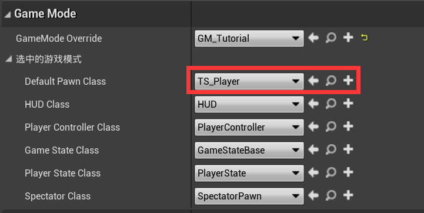

> **注意：**如果你的主编辑器面板还没有World Settings面板，在Toolbar选择**Settings\\World Settings**调出面板。

现在运行游戏你就能控制**TS\_Player**了，按下**Play**并使用**W**，**S**，**A**和**D**来进行移动。

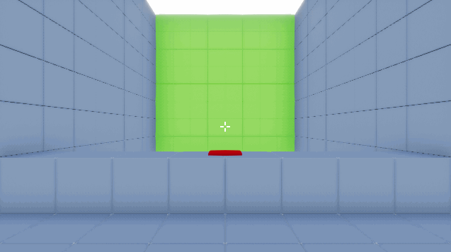

我们接着创建输入映射来观察四周。

### 创建观察映射

打开**Project Settings**，再创建两个**轴映射**，分别命名为**LookHorizontal**和**LookVertical**。

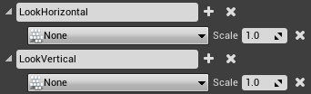

将**LookHorizontal**的键位改为**Mouse X**。

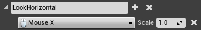

这样当鼠标向**右**滑动时会输出正数，反之亦然。

接着，将**LookVertical**的键位改为**Mouse Y**。

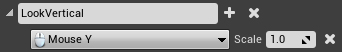

这样当鼠标**向上**滑动时会输出正数，反之亦然。

现在，我们要写点逻辑来实现转动视角。

#### 实现转动视角

如果一个Pawn上没有**Camera**组件，Unreal会自动为你创建一个摄像机。默认情况下，摄像机会使用**控制器**的旋转。

> **注意：**如果你想了解更多关于控制器的内容，可以查看AI部分教程。

虽然控制器并没有物理实体，它仍旧有自己的旋转。这意味着我们可以让角色和摄像机面向不同方向。比如，在第三人称游戏里，角色和摄像机并不总是处于同一方向。

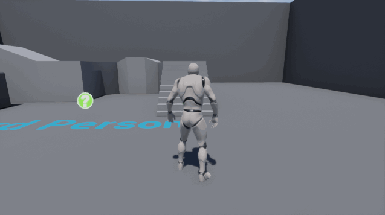

要在第一人称视角里转动摄像机，我们所要做的就是修改控制器的旋转。

在**TS\_Player**输入**LookHorizontal**和**LookVertical**的处理代码：

```typescript
class TS_Player extends UE.Character {
    // ... other code

    LookHorizontal(axisValue: number): void {
        this.AddControllerYawInput(axisValue);
    }

    LookVertical(axisValue: number): void {
        this.AddControllerPitchInput(axisValue * -1);
    }
}
```

 和之前左右移动类似，有点差异的是**LookVertical**会将axisValue乘以-1，如果不这么处理，视角上下移动和大多数人的习惯不太一致。

保存文件，按下**Play**运行游戏，使用鼠标来转动视角吧。

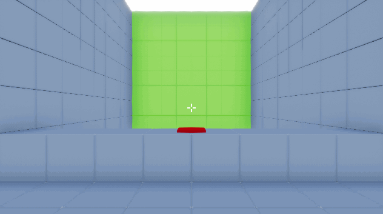

现在移动和视角转动都实现了，是时候搞把枪了！

### 创建枪支

#### 创建枪支基类

在TypeScript目录下新建TS\_BaseGun.ts，输入如下代码：

```typescript
import * as UE from 'ue'
class TS_BaseGun extends UE.Actor {
    MaxBulletDistance: number;
    Damage: number;
    FireRate: number;
    GunMesh: UE.StaticMeshComponent;
}
export default TS_BaseGun;
```

 我们在TS\_BaseGun类里头定义了几个number类型的变量，它们含义分别是：

* **MaxBulletDistance：**子弹最远飞行距离
* **Damage：**子弹伤害
* **FireRate：**子弹发射间隔（秒）

> **注意：**每个变量的默认值都是0，对本例来说没什么问题。然而，如果你希望新的枪支类有别的默认值，你需要在**BP\_BaseGun**设置下。

**GunMesh**是StaticMeshComponent类型的变量，是枪支的外形，我们会在创建枪械子类时初始化它。

#### 创建枪械子类

保存后，添加TS\_Rifle.ts，输入如下代码：

```typescript
import TS_BaseGun from './TS_BaseGun'
import * as UE from 'ue'

import './ObjectExt'

class TS_Rifle extends TS_BaseGun {
    Constructor() {
        this.MaxBulletDistance = 5000;
        this.Damage = 2;
        this.FireRate = 0.1;

        this.GunMesh = this.CreateDefaultSubobjectGeneric<UE.StaticMeshComponent>("GunMesh", UE.StaticMeshComponent.StaticClass());
        this.GunMesh.StaticMesh = UE.StaticMesh.Load("/Game/BlockBreaker/Meshes/SM_Rifle");
        this.RootComponent = this.GunMesh;
    }
}

export default TS_Rifle;
```

 代码多起来了，别慌，听我一一道来：

1.  那几个number变量在TS\_BaseGun的子类TS\_Rifle的子类初始化，意味着来复枪每颗子弹能最远飞行**5000**单位的距离。如果子弹命中Actor，能对其造成**2**点伤害。当持续开火射击时，射击间隔不少于**0.1**秒。
2.  我们通过CreateDefaultSubobjectGeneric，创建了个StaticMeshComponent对象，并加载它的StaticMesh属性

注：Object的CreateDefaultSubobject方法用于创建子对象，但鉴于该方法参数较多，而且返回的是基类Object，不便于使用，我们稍稍封装了一下（CreateDefaultSubobjectGeneric），封装的实现在ObjectExt.ts，代码如下

```typescript
import * as UE from 'ue'

declare module "ue" {
    interface Object {
        CreateDefaultSubobjectGeneric<T extends UE.Object>(SubobjectFName: string, ReturnType: UE.Class) : T
    }
}

UE.Object.prototype.CreateDefaultSubobjectGeneric = function CreateDefaultSubobjectGeneric<T extends UE.Object>(SubobjectFName: string, ReturnType: UE.Class) : T {
    return this.CreateDefaultSubobject(SubobjectFName, ReturnType, ReturnType, /*bIsRequired =*/ true, /*bIsAbstract =*/ false, /*bTransient =*/ false) as T;
}
```

这把枪现在就完成了。

接着，我们要创建自己的摄像机组件了。这样能够更好地控制摄像机位置，我们还可以将枪支跟摄像机绑定在一起，这样枪支就能始终保持在摄像机的正面了。

### 创建摄像机

打开**TS\_Player.ts**并新增几个变量

```typescript
import * as UE from 'ue'
import TS_BaseGun from './TS_BaseGun'
import {$ref, $unref} from 'puerts' //和本节无关，但后面要用到
import './ObjectExt' 

class TS_Player extends UE.Character {
    FpsCamera: UE.CameraComponent;
    EquippedGun:TS_BaseGun;
    GunLocation:UE.SceneComponent;
    
    // other code...
}

export default TS_Player;
```

这几个变量的含义分别是

* **FpsCamera**: 摄像机;
* **EquippedGun**:枪的引用;
* **GunLocation**:枪的位置;

添加构造函数，初始化FpsCamera，GunLocation：

```typescript
class TS_Player extends UE.Character {
    // other code...

    Constructor() {
        let FpsCamera = this.CreateDefaultSubobjectGeneric<UE.CameraComponent>("FpsCamera", UE.CameraComponent.StaticClass());
        FpsCamera.SetupAttachment(this.CapsuleComponent, "FpsCamera");
        FpsCamera.K2_SetRelativeLocationAndRotation(new UE.Vector(0, 0, 90), undefined, false, $ref<UE.HitResult>(undefined), false);
        FpsCamera.bUsePawnControlRotation = true;
        this.FpsCamera = FpsCamera;

        this.GunLocation = this.CreateDefaultSubobjectGeneric<UE.SceneComponent>("GunLocation", UE.SceneComponent.StaticClass());
        this.GunLocation.SetupAttachment(this.FpsCamera, "GunLocation");
        this.GunLocation.K2_SetRelativeLocationAndRotation(new UE.Vector(30, 14, -12), new UE.Rotator(0, 95, 0), false, $ref<UE.HitResult>(undefined), false);
    }

    // other code...
}
```

代码解释

1.  创建名为FpsCamera的相机，并attach到CapsuleComponent下
2.  设置相机的位置
3.  默认情况下，摄像机组件并不使用控制器的旋转。要修正这点，bUsePawnControlRotation设置为true
4.  创建一个SceneComponent作为枪支的位置，将其attach到相机下
5.  设置GunLocation的位置和旋转

#### 生成并绑定枪支

TS\_Player下添加ReceiveBeginPlay方法，这个函数会在游戏开始的时候被引擎调用，在该方法添加来复枪的生成和绑定逻辑

```typescript
class TS_Player extends UE.Character {
    // other code...

    ReceiveBeginPlay(): void {
        let ucls  = UE.Class.Load("/Game/Blueprints/TypeScript/TS_Rifle.TS_Rifle_C");
        this.EquippedGun = UE.GameplayStatics.BeginDeferredActorSpawnFromClass(this, ucls, undefined, UE.ESpawnActorCollisionHandlingMethod.Undefined, this) as TS_BaseGun;
        UE.GameplayStatics.FinishSpawningActor(this.EquippedGun, undefined);

        this.EquippedGun.K2_AttachToComponent(this.GunLocation, undefined, UE.EAttachmentRule.SnapToTarget, UE.EAttachmentRule.SnapToTarget, UE.EAttachmentRule.SnapToTarget, true);
    }
}
```

保存后点击运行，这时可以看到我们有了枪。

现在有趣的地方来了：射击子弹！要检测子弹是否打中东西，我们要用上**射线检测（line trace）**。

### 射击子弹

射线检测是一个包含开始点和结束点（两点成线）的函数，它会检测这条线上的每个点，看是否碰到其他物体。在游戏中，这是用于检测子弹是否打中东西的最普遍做法。

由于射击是属于枪支的特性，射击函数应该设计在枪支类里，而不是角色类。在**TS\_BaseGun**类中添加创建名为**Shoot**的函数。

```typescript
class TS_BaseGun extends UE.Actor {
    //other code

    //@no-blueprint
    Shoot(StartLocation: UE.Vector, EndLocation: UE.Vector): void {
        let hitResultOut = $ref<UE.HitResult>(undefined);
        if (UE.KismetSystemLibrary.LineTraceSingle(this, StartLocation, EndLocation, 0, false, undefined, 0, hitResultOut, true, undefined, undefined, 0)) {
            let hitResult = $unref(hitResultOut);
            UE.GameplayStatics.SpawnEmitterAtLocation(this, this.PS_BulletImpact, hitResult.Location, new UE.Rotator(0, 0, 0), new UE.Vector(1, 1, 1), true, UE.EPSCPoolMethod.AutoRelease, true);
        }
    }
}
```

代码解释

1.  使用**LineTraceByChannel**函数来执行射线检测。这个节点会使用**可视力（Visibility）**或者**摄像机（Camera）**碰撞通道来进行碰撞检测。 
2.  通过\$ref创建引用类型，用于碰撞信息的输出
3.  如果检测到碰撞到碰撞（**LineTraceByChannel**返回值为true），则使用**SpawnEmitteratLocation**函数在碰撞位置生成粒子特效**PS\_BulletImpact**
4.  \@no-blueprint告诉系统别生成对应的蓝图方法，因为这个方法我们只在TypeScript里头调用

#### 调用射击函数

首先，我们需要创建射击的按键映射。点击**Compile**并打开**Project Settings**。创建一个新的**Axis Mapping**并命名为**Shoot**，将其按键设为**Left Mouse Button**，然后关闭**Project Settings**。

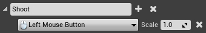

打开TS\_Player.ts，添加Shoot事件处理

```typescript
class TS_Player extends UE.Character {
    //other code...

    Shoot(axisValue: number): void {
        if (axisValue == 1) { 
            let cameraLocation = this.FpsCamera.K2_GetComponentLocation();
            let endLocation = cameraLocation.op_Addition(this.FpsCamera.GetForwardVector().op_Multiply(this.EquippedGun.MaxBulletDistance));
            this.EquippedGun.Shoot(cameraLocation, endLocation); 
        }
    }
}
```

 代码解释

1.  如果玩家按下了鼠标左键，则调用枪支的Shoot函数
2.  Shoot函数射线检测的起始点是相机的位置，终点= 相机位置 + 相机朝向 \* 枪支射程

保存文件，按下**Play**运行游戏，按住**鼠标左键**开始发射子弹吧！

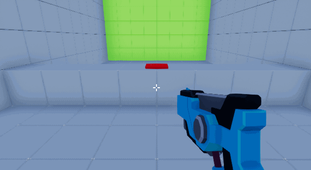

现在，枪支是每帧都在射击的，射速实在是有点太快了，所以下一步要降低枪支的开火速度。

### 降低开火速度

首先，我们需要一个变量检测玩家是否正在射击。打开TS**\_Player**创建**boolean**类型变量，命名为**CanShoot**，将其默认值设为**true**。如果**CanShoot**等于**true**，说明玩家正在射击。

另外，将Shoot逻辑稍作改造

```typescript
class TS_Player extends UE.Character {
    // other code ..
    CanShoot: boolean;

    Constructor() {
        // other code ..
        this.CanShoot = true;
    }

    // other code ..

    //@no-blueprint
    async AShoot(axisValue: number): Promise<void> {
        if (axisValue == 1 && this.CanShoot) {
            let cameraLocation = this.FpsCamera.K2_GetComponentLocation();
            let endLocation = cameraLocation.op_Addition(this.FpsCamera.GetForwardVector().op_Multiply(this.EquippedGun.MaxBulletDistance));
            this.EquippedGun.Shoot(cameraLocation, endLocation);
            this.CanShoot = false;
            await delay(this.EquippedGun.FireRate * 1000);//TODO: 支持Latent方法转async方法后，可以用KismetSystemLibrary.Delay
            this.CanShoot = true;
        }
    }

    Shoot(axisValue: number): void {
        this.AShoot(axisValue)
    }
}
```

 代码解释：

1.  由于我们要用到异步的等待，我们把前面的Shoot逻辑移动到一个async版本的AShoot函数，添加\@no-blueprint声明其只在TypeScript中使用
2.  只有按下鼠标而且CanShoot变量为true时才允许射击
3.  调用EquippedGun射击后，把CanShoot改为false，按枪支的射速延时后设置CanShoot为true

里头用到的delay函数时用setTimeout的简单封装，熟悉TypeScript的同学应该都知道怎么写。

保存后，按下**Play**运行游戏测试下枪支的射速吧！

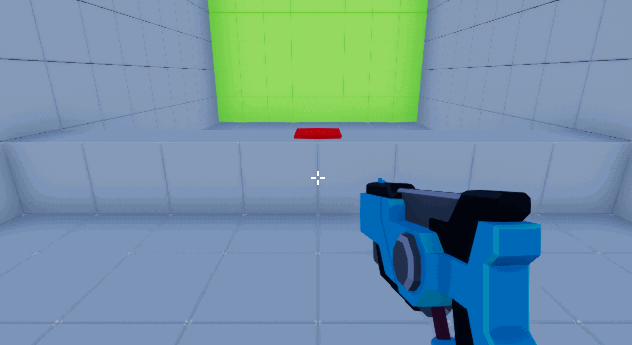

### 实现受击

在Unreal里，每个Actor都能受击。然而，Actor要对受击伤害做出什么处理是可以自由定义的。

比如，当战斗中的游戏角色当受击时，会扣除血量。然而，像气球一类物体是没有血量概念的。取而代之的，我们会编写逻辑让气球在受击时爆炸。

**打开TS\_BaseGun.ts，在Shoot函数添加受击逻辑**

```typescript
class TS_BaseGun extends UE.Actor {
    // other code ..

    //@no-blueprint
    Shoot(StartLocation: UE.Vector, EndLocation: UE.Vector): void {
        let hitResultOut = $ref<UE.HitResult>(undefined);
        if (UE.KismetSystemLibrary.LineTraceSingle(this, StartLocation, EndLocation, 0, false, undefined, 0, hitResultOut, true, undefined, undefined, 0)) {
            let hitResult = $unref(hitResultOut);
            UE.GameplayStatics.SpawnEmitterAtLocation(this, this.PS_BulletImpact, hitResult.Location, new UE.Rotator(0, 0, 0), new UE.Vector(1, 1, 1), true, UE.EPSCPoolMethod.AutoRelease, true);
            if (hitResult.Actor) {
                UE.GameplayStatics.ApplyDamage(hitResult.Actor, this.Damage, undefined, undefined, undefined);
            }
        }
    }
}
```

新增的只是if \(hitResult.Actor\) \{\}这段，简单的对碰撞到的Actor调用下ApplyDamage，把枪支的伤害值传过去。

现在我们需要处理每种Actor对于受击伤害的反馈。这部分内容原来的蓝图教程很简单，只是简单调用了下封装好的逻辑，我就不改造成TypeScript了，保留原文，有兴趣的同学可以继续实现；要改造需要用TypeScript实现其例子已经封装好的逻辑，而且要把地图里头的绿墙上方块，红色按钮都换成TypeScript模块。

#### 处理受击

首先，我们需要处理目标获得伤害数据，打开**BP\_Target**并创建**Event AnyDamage**事件节点，这个节点会在受到伤害且其数值**不为零**时触发执行。

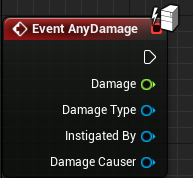

随后，调用**TakeDamage**函数并连接**Damage**引脚。这个函数会将目标的**Health**变量减去Damage数值，并更新目标的颜色。

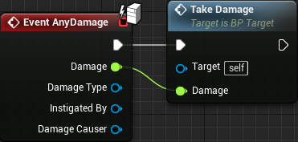

现在，当目标受到伤害时，它就会扣除血量了。点击**Compile**并关闭**BP\_Target**。

接着，我们需要处理按钮对伤害的反馈。打开**BP\_ResetButton**并创建**Event AnyDamage**。随后，调用**ResetTargets**函数。

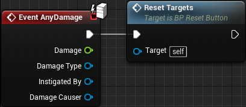

这个函数会在按钮受击时调用并重置所有目标的状态。点击**Compile**并关闭**BP\_ResetButton**。

按下**Play**运行游戏开始射击目标。如果你想要重置所有目标，就朝按钮射击。


### 后续学习

虽然本篇教程中所制作是一个非常简单的FPS游戏，你可以在此基础上进一步扩展，试着创建更多具有不用射速和伤害的枪械，也可以尝试添加装弹功能！

[相关代码](src)
